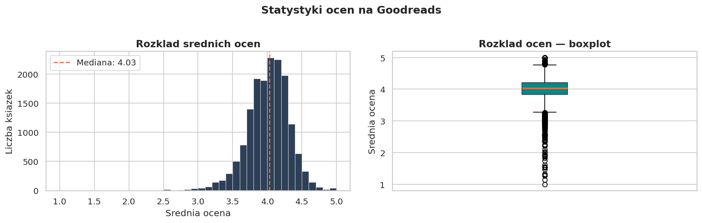
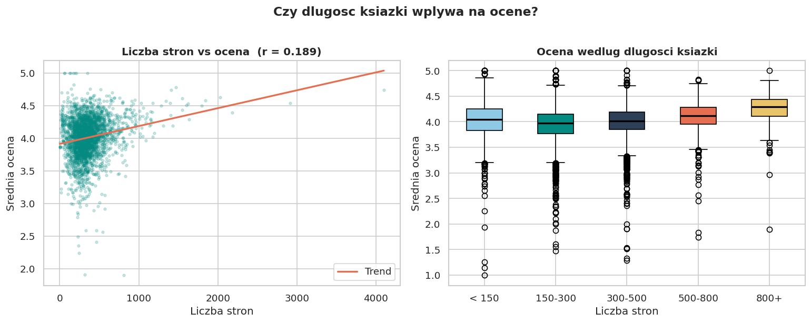
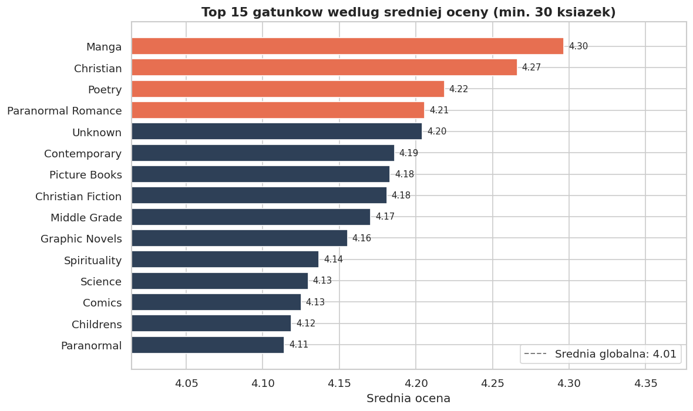
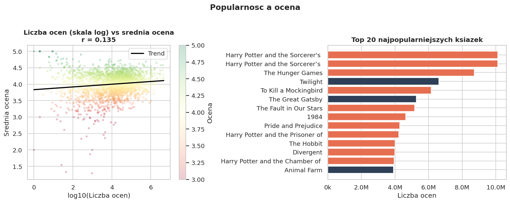

# 📚 Co sprawia, że książki dostają 5-gwiazdek?
## Kompleksowa Analiza Ekosystemu Goodreads (Maj 2024)

##  O Projekcie
Projekt powstał, aby odpowiedzieć na fundamentalne pytanie każdego mola książkowego i wydawcy: **czy istnieją mierzalne czynniki, które gwarantują sukces książki?** Korzystając z danych z serwisu Goodreads (stan na maj 2024), zbadałam zależności między cechami fizycznymi książki (liczba stron), jej przynależnością gatunkową a odbiorem przez czytelników.
---

##  Wykorzystanie AI (Prompt Engineering)
W pracy nad projektem wykorzystałam techniki **Prompt Engineeringu**, aby zoptymalizować proces analizy:
* **Optymalizacja kodu:** Wykorzystałam LLM do stworzenia bazy funkcji czyszczących dane (RegEx), które następnie samodzielnie przetestowałam i dostosowałam do specyfiki zbioru danych.
* **Iteracyjne rozwiązywanie problemów:** Poprzez precyzyjne formułowanie zapytań, szybciej zidentyfikowałam przyczyny błędów w parsowaniu kolumn z listami.

**Po co?** Dzięki synergii moich umiejętności analitycznych i narzędzi AI, projekt powstał szybciej, a kod jest czystszy i lepiej udokumentowany.

##  Proces Badawczy (Co zrobiłam i po co?)

### 1. Inżynieria i czyszczenie danych
Zanim przeszłam do analizy, **musiałam przygotować surowy zbiór danych**, który zawierał sporo błędów formatowania:
* **Problem:** Liczba stron była zapisana jako tekst w listach (np. `['400']`).
* **Rozwiązanie:** Napisałam  funkcję parsującą z wykorzystaniem **wyrażeń regularnych (RegEx)**, która oczyściła te dane i skonwertowała je na liczby całkowite.
* **Cel:** Bez tego etapu nie mogłabym zbadać korelacji między długością książki a oceną.

### 2. Rozkład Ocen (Sentiment Analysis)
**Zbadałam**, jak rozkładają się oceny wystawiane przez użytkowników.
* **Co odkryłam:** Średnia ocena to **4.12**.
* **Wniosek:** Dowiedziałam się, że społeczność Goodreads jest dość hojna w ocenach, a każda nota poniżej 3.5 jest sygnałem, że książka może być słaba lub kontrowersyjna.

  

### 3. Mit "Liczby Stron"
**Postawiłam hipotezę**, że grubsze książki mogą nużyć czytelników i otrzymywać niższe noty.
* **Metoda:** Wykonałam wykres rozrzutu (*Scatter Plot*) zestawiający liczbę stron ze średnią oceną.
* **Wynik:** Współczynnik korelacji okazał się bliski zeru.
* **Wniosek:** Udowodniłam, że **długość książki nie ma znaczenia dla jej jakości**. Czytelnicy oceniają historię, a nie jej objętość.

  

### 4. Analiza Gatunków (Top 15)
**Zestawiłam ze sobą średnie oceny dla różnych kategorii literackich.**
* **Odkrycie:** Najwyżej oceniane są gatunki niszowe, takie jak *Christian Fiction* czy literatura religijna.
* **Interpretacja:** Zauważyłam, że niszowi autorzy mają bardziej oddanych fanów, co przekłada się na wyższe średnie w porównaniu do literatury głównego nurtu (Mainstream).

  

---

##  Paradoks Popularności
Ciekawym etapem mojej pracy było porównanie liczby ocen z ich wysokością. **Zauważyłam**, że im bardziej książka staje się popularna (miliony ocen), tym trudniej jej utrzymać ekstremalnie wysoką notę. To naturalny efekt trafiania do odbiorców spoza grupy docelowej.

  

---

##  Struktura Repozytorium
* `books_project/data/` – Tu przechowuję surowy plik CSV.
* `books_project/images/` – Wszystkie wykresy, które **wygenerowałam w Pythonie**.
* `books_project/notebooks/` – [Notatnik z moim kodem](books_project/notebooks/goodreads_analiza.ipynb) – tu możesz zobaczyć jak pracowałam.

---

##  Wnioski końcowe
Dzięki tej analizie **wyciągnęłam jasne wnioski**: w świecie Goodreads autentyczność gatunkowa jest ważniejsza niż marketing czy objętość dzieła. Projekt ten pozwolił mi rozwinąć umiejętności w zakresie statystyki, czyszczenia danych oraz wizualizacji.
